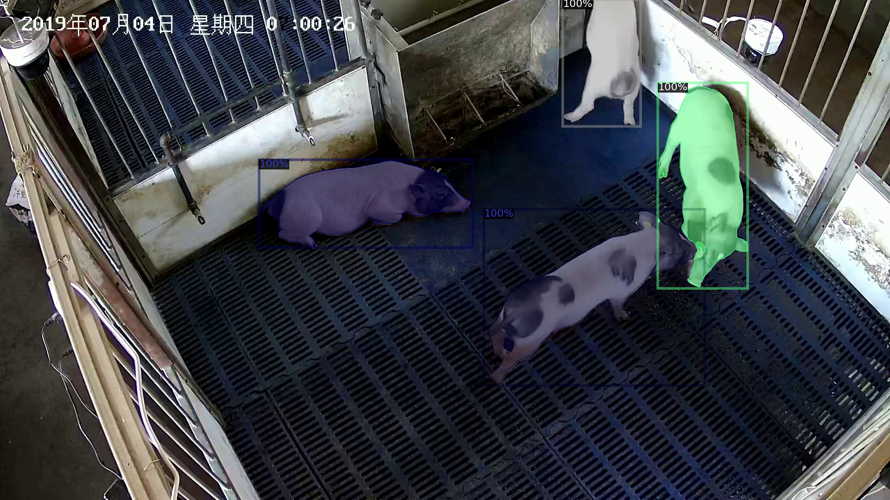
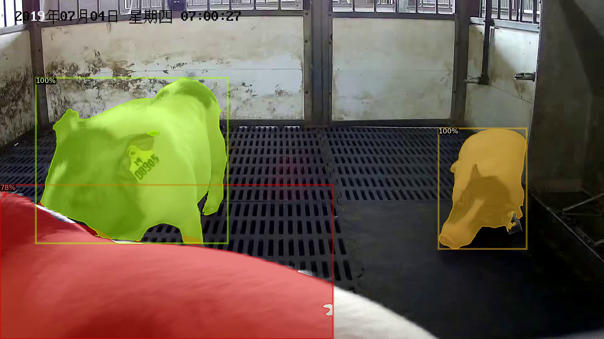
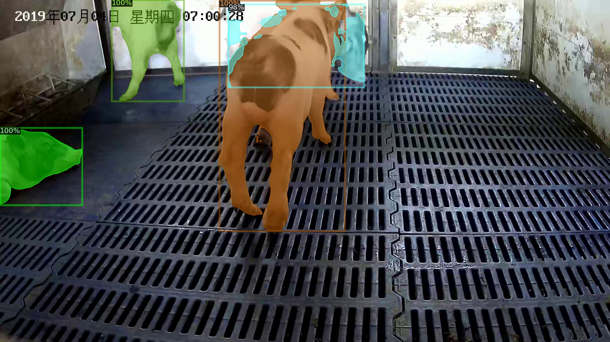

# Pig_Silhouette_Det
This repository is the official implementation of pig object and silhouette detection used in the paper:

An, L., Ren, J., Yu, T., Hai, T., Jia, Y., &Liu, Y. Three-dimensional surface motion capture of multiple freely moving pigs using MAMMAL. *biorxiv* (2022). 

[[project]()] [[paper]()]

<p float="center">
  
   
  
</p>

Other related repositories: 
* [MAMMAL_core]() 
* [MAMMAL_datasets](https://github.com/anl13/MAMMAL_datasets)
* [MAMMAL_evaluation](https://github.com/anl13/MAMMAL_evaluation) 
* [MAMMAL_behavior](https://github.com/anl13/MAMMAL_behavior) 
* [pig_pose_det](https://github.com/anl13/pig_pose_det)
* [PIG_model](https://github.com/anl13/PIG_model) 


## Environments 
These code was tested on Ubuntu 20.04 (or Ubuntu 18.04), python3.6, NVIDIA TITAN X (or NVIDIA GeForce 1080Ti, NVIDIA RTX 2080Ti), pytorch >= 1.4.0. We recommend to use anaconda to mange virtual environments. Specifically, after installing anaconda, create a virtual environment by 
```shell 
conda create -n PIG_MASK python=3.6
conda activate PIG_MASK
```
Then, install the newest pytorch by 
```shell
conda install pytorch torchvision torchaudio cudatoolkit=11.3 -c pytorch
```
Note that, change cuda version to your own local cuda version. Older version (>=1.4.0) are also compatible. 
You should also install some other packages like 
```shell 
pip install opencv-python 
```

## Install Detectron2
As this project is based on PointRend (built upon [detectron2](https://github.com/facebookresearch/detectron2.git)), you need to download the detectron2 and install it. We used an old version of detectron2 (v0.2), however, higher version may also work (we did not test). Lower version (v0.1.3) has been tested and works well. 
```
git clone https://github.com/facebookresearch/detectron2.git
cd detectron2 
git checkout v0.2
python -m pip install -e .
```
Here, we denote the detectron2 folder path as `${DETECTRON2_PATH}`. 
## Train and Test PointRend
1. Download the [BamaPig2D dataset](https://github.com/anl13/MAMMAL_datasets) and uncompress it. Denote the dataset path as `${BamaPig2D_path}`. 
2. Copy `test_pig.py`, `train_pig.py` and `demo_BamaPig3D.py` to `${DETECTRON2_PATH}/projects/PointRend/`. Copy config file `pointrend_rcnn_R_50_FPN_3x_coco-pig.yaml` to `${DETECTRON2_PATH}/projects/PointRend/configs/InstanceSegmentation/`. Download resnet-50_FPN_3x weights pretrained on ImageNet from [detectron2 ModelZoo](https://github.com/facebookresearch/detectron2/blob/main/MODEL_ZOO.md). Or you can simply download my copy from [Google Drive](https://drive.google.com/file/d/1h9KO_UVrRhJWIezNpRwgA4JijtuSDjku/view?usp=sharing) or [Baidu Drive](https://pan.baidu.com/s/1pcxekhmdmsJM5N6ILebmqQ) (extract code: vuic). After downloading, you will get a `R-50.pkl` file, and put it under `${DETECTRON2_PATH}/projects/PointRend/`. 
3. Go to `${DETECTRON2_PATH}/projects/PointRend/` and run `train_pig.py`. 
```shell
cd ${DETECTRON2_PATH}/projects/PointRend/
CUDA_VISIBLE_DEVICES=0 python train_pig.py \
--config-file configs/InstanceSegmentation/pointrend_rcnn_R_50_FPN_3x_coco-pig.yaml \
--dataset_path ${BamaPig2D_path}
```
Don't forget to replace `${BamaPig2D_path}` and `${DETECTRON2_PATH}` to your own path. By default, the trained model and log will be saved at `output/` folder. You can change that by modifying `pointrend_rcnn_R_50_FPN_3x_coco-pig.yaml`.

The training process may take 5 days on single NVIDIA GeForce 1080Ti. 
4. After training, it will give you the evaluation results automatically. However, if you want to run evaluation independently, you can run 
```shell
CUDA_VISIBLE_DEVICES=0 python test_pig.py --config-file output/config.yaml \
--dataset_path ${BamaPig2D_path}
```
## Test on Pretraind Model
You can download the pretrained weights (`output_20210225.zip`) from [Google Drive](https://drive.google.com/file/d/1Bft9pSlEESaLYU62UuTQaYEYIPE2brPZ/view?usp=sharing) or [Baidu Drive](https://pan.baidu.com/s/1kwUM8cnmwHySH-fX_xWi3w) (extract code: iyb8). Then, unzip it and put the folder to `${DETECTRON2_PATH}/projects/PointRend/` as `${DETECTRON2_PATH}/projects/PointRend/output_20210225/`. The run test file 
```shell
CUDA_VISIBLE_DEVICES=0 python test_pig.py --config-file output_20210225/config.yaml \
--dataset_path ${BamaPig2D_path}
```

## Demo on BamaPig3D Dataset
1. Download the [BamaPig3D dataset](https://github.com/anl13/MAMMAL_datasets), and the dataset path is denoted as `${data3d_path}`. 
2. Prepare pretrained model following the above instruction. 
3. In `${DETECTRON2_PATH}/projects/PointRend/`, just run 
```shell
CUDA_VISIBLE_DEVICES=0 python demo_BamaPig3D.py --config-file output_20210225/config.yaml \
--data3d_path ${data3d_path} \
--write_dir ./BamaPig3D_result/
```
It will write bounding boxes to `./BamaPig3D_result/boxes_pr/` and silhouettes to `./BamaPig3D_result/masks_pr/`. The results should be same to that provided in BamaPig3D dataset. Do not forget to change `${data3d_path}` to your own BamaPig3D path. 

## Citation
If you use this code in your research, please cite the paper 
```BibTex
@article{MAMMAL, 
    author = {An, Liang and Ren, Jilong and Yu, Tao and Jia, Yichang and Liu, Yebin},
    title = {Three-dimensional surface motion capture of multiple freely moving pigs using MAMMAL},
    booktitle = {biorxiv},
    month = {July},
    year = {2022}
}

@InProceedings{kirillov2019pointrend,
  title={{PointRend}: Image Segmentation as Rendering},
  author={Alexander Kirillov and Yuxin Wu and Kaiming He and Ross Girshick},
  journal={IEEE/CVF Conference on Computer Vision and Pattern Recognition (CVPR)},
  year={2020}
}
```

## Contact 
* Liang An (al17@mails.tsinghua.edu.cn)